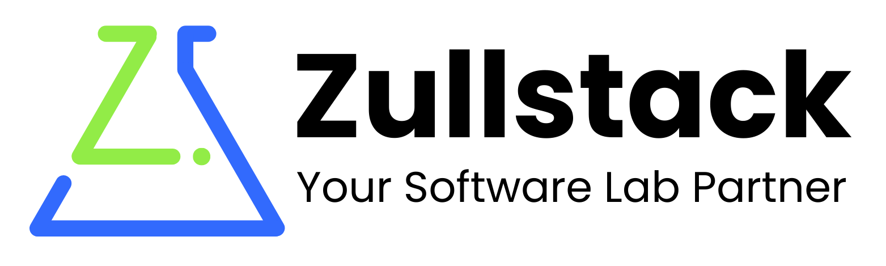

<a href="https://zullstack.dev">
  <picture>
    <source media="(prefers-color-scheme: dark)" srcset="./assets/banner-dark.png">
    <source media="(prefers-color-scheme: light)" srcset="./assets/banner-light.png">
    
  </picture>
</a>

# Hi, I'm Zulkifli 👋

**Fullstack Engineer & Coding Mentor** · *Your Software Lab Partner* · 📍 Jakarta, Indonesia

---

## `// about`

I build software end to end: APIs that hold up under load, interfaces that feel considered, mobile apps that ship, and the pipelines that carry all of it to production. Then I teach the engineers who take it from there.

- 🧪 **6+ years** shipping production systems for Indonesian government ministries, enterprises and startups across web, mobile and backend
- 🏗️ **Solution Architect @ [Duta Firza Mulia](https://df18.co.id)**: I design systems end to end, from architecture through to delivery
- ⚙️ **Previously Senior Software Engineer @ [Technoverse](https://technoverse.ltd)**: I led full-stack client work and shipped AI-powered features built on the OpenAI and Claude APIs
- 🎓 **Former Lead of Program Development @ [Hacktiv8](https://hacktiv8.com)**: I ran the Golang, Generative AI, UI/UX and Marketing tracks after years teaching full-stack JavaScript to cohorts of 30+
<!-- - 🧰 Core in **React, Next.js and Node.js**, with Go, React Native, Flutter and cloud infrastructure (AWS, GCP) alongside -->
<!-- - 📊 **6+** years · **13** shipped projects · **40+** technologies -->

## `// stack`

**Frontend** 

**Backend** 

**Mobile** 

**AI & LLM** 
![OpenAI API](https://img.shields.io/badge/OpenAI_API-0b0d12?style=flat-square&logo=data:image/svg%2bxml;base64,PHN2ZyBmaWxsPSIjOTJlYzQ3IiB4bWxucz0iaHR0cDovL3d3dy53My5vcmcvMjAwMC9zdmciIHZpZXdCb3g9IjAgMCAyNCAyNCI+PHRpdGxlPk9wZW5BSTwvdGl0bGU+PHBhdGggZD0iTTIyLjMgOS44YTYgNiAwIDAgMC0uNS00LjlBNiA2IDAgMCAwIDE1LjMgMiA2IDYgMCAwIDAgNSA0LjIgNiA2IDAgMCAwIDEgN2E2IDYgMCAwIDAgLjcgNyA2IDYgMCAwIDAgLjUgNSA2IDYgMCAwIDAgNi42IDMgNiA2IDAgMCAwIDQuNSAyIDYgNiAwIDAgMCA1LjctNC4yIDYgNiAwIDAgMCA0LTMgNiA2IDAgMCAwLS43LTdtLTkgMTIuNmE1IDUgMCAwIDEtMy0xaC4ybDQuOC0yLjkuNC0uNlYxMWwyIDEuMlYxOGE0LjUgNC41IDAgMCAxLTQuNCA0LjVtLTkuNy00LjFhNSA1IDAgMCAxLS41LTNoLjFMOCAxOC4yaC44bDUuOC0zLjNWMTdsLTQuOSAzYTQuNSA0LjUgMCAwIDEtNi4xLTEuN00yLjMgNy45YTUgNSAwIDAgMSAyLjQtMnY1LjdsLjQuNyA1LjggMy4zLTIgMS4yLTUtMi44YTQuNSA0LjUgMCAwIDEtMS41LTZ6TTE5IDExLjhsLTUuOC0zLjQgMi0xLjIgNSAyLjhhNC41IDQuNSAwIDAgMS0uOCA4LjF2LTUuN3ptMi0zdi0uMkwxNiA2aC0uOEw5LjQgOS4yVjdsNC45LTNhNC41IDQuNSAwIDAgMSA2LjYgNC43em0tMTIuNiA0LTItMS4xVjZhNC41IDQuNSAwIDAgMSA3LjMtMy41bC0uMS4xLTQuOCAyLjgtLjQuNnptMS4xLTIuM0wxMiA5bDIuNiAxLjV2M0wxMiAxNWwtMi42LTEuNVoiLz48L3N2Zz4=&logoColor=92ec47)

**DevOps & Cloud** 

![AWS EC2 S3](https://img.shields.io/badge/AWS_%28EC2%2C_S3%29-0b0d12?style=flat-square&logo=data:image/svg%2bxml;base64,PHN2ZyBmaWxsPSIjOTJlYzQ3IiB4bWxucz0iaHR0cDovL3d3dy53My5vcmcvMjAwMC9zdmciIHZpZXdCb3g9IjAgMCAyNCAyNCI+PHRpdGxlPkFtYXpvbiBXZWIgU2VydmljZXM8L3RpdGxlPjxwYXRoIGQ9Ik02LjggMTB2LjdsLjMuNnYuNGwtLjYuNGgtLjRsLS4zLS40LS4zLS41YTMgMyAwIDAgMS0yLjMgMXEtMSAwLTEuNi0uNWEyIDIgMCAwIDEtLjYtMS41cTAtMSAuNy0xLjcuOC0uNiAyLS42bDEuNy4zdi0uNnEwLS45LS4zLTEuMy0uNC0uNC0xLjMtLjRsLS45LjEtLjkuMy0uMi4xaC0uMmwtLjEtLjJ2LS43bC4yLS4xIDEtLjRMNCA0LjhxMS40IDAgMiAuNy43LjUuNyAyem0tMy4zIDEuMmguOGwuOC0uNi4zLS41VjlsLS43LS4ySDRxLS45IDAtMS4yLjMtLjQuMy0uNCAxIDAgLjUuMy44dC44LjNtNi40IDEtLjMtLjItLjEtLjMtMi02LjF2LS40cTAtLjIuMi0uMmguOGwuMy4xLjIuMyAxLjMgNS4zIDEuMi01LjMuMi0uM0gxM2wuMS4zIDEuMyA1LjQgMS40LTUuNC4xLS4zSDE3bC4yLjF2LjRsLTIgNi4xcTAgLjMtLjIuM2wtLjMuMWgtMWwtLjEtLjQtMS4zLTUuMS0xLjIgNS4xcTAgLjMtLjIuM2wtLjMuMXptMTAuMy4xQTUgNSAwIDAgMSAxOCAxMmwtLjItLjNWMTFsLjEtLjJoLjRhNCA0IDAgMCAwIDEuOC40cS43IDAgMS4yLS4yYTEgMSAwIDAgMCAuNC0uOGwtLjItLjUtLjgtLjUtMS4yLS4zcS0uOS0uMy0xLjMtLjhhMiAyIDAgMCAxLS40LTEuMkwxOCA2bC42LS42LjgtLjQgMS42LS4xaC41bC44LjMuMi4yLjEuM1Y2cTAgLjItLjIuMmgtLjNsLTEuNS0uNC0xIC4ycS0uNC4zLS40Ljd0LjIuNnEuMi4zLjkuNGwxLjEuNHEuOS4zIDEuMi44LjQuNS40IDF0LS4yIDEtLjYuN3EtLjMuMy0uOS41em0xLjUgNEExNy42IDE3LjYgMCAwIDEgLjEgMTQuNnEtLjItLjYuMy0uNGEyNCAyNCAwIDAgMCAyMSAxLjNjLjQtLjIuNy4zLjMuNm0xLTEuM2MtLjItLjUtMi4xLS4yLTMtLjFxLS40IDAgMC0uNGMxLjUtMSA0LS44IDQuMi0uNHMwIDIuOC0xLjUgNHEtLjQuMi0uMy0uMWMuMy0uOCAxLTIuNi43LTMiLz48L3N2Zz4=&logoColor=92ec47)

**Database** 

**Testing & QA** 

-0b0d12?style=flat-square&logo=swagger&logoColor=92ec47)

**Tools** 

**Practices:** Agile/Scrum · Git Flow · TDD · SOLID · Clean Code · Design Patterns · Responsive Design · Accessibility (a11y)

## `// featured work`

| Project | Role | Year | What it is |
|---|---|---|---|
| **[SAMAN](https://saman.kemenbud.go.id)** Anti-Fraud Monitoring System | PM & Frontend Lead | 2025 | The first anti-fraud monitoring system among Indonesia's ministerial inspectorates, officially launched by the Minister of Culture. |
| **[HipmiGO](https://hipmigo.co.id)** Super App for HIPMI | Frontend & Mobile | 2023–24 | The official super app for Indonesia's Young Entrepreneurs Association, with 10,000+ downloads across iOS and Android. |
| **[Culminaite](https://culminaite.com)** AI-Powered Career Platform | Full-Stack (solo) | 2025 | An AI career platform for the Malaysian job market. I built it and run it solo, and it has served 100+ customers since launch. |
| **[IDBuild](https://idbuildapp.com)** Interior Design Project Management | Full-Stack (solo) | 2025 | A SaaS platform that interior design firms use to run commercial office projects end to end. Built solo. |

→ More on <a href="https://zullstack.dev/projects">zullstack.dev/projects</a>

## `// experience`

- **[Duta Firza Mulia](https://df18.co.id)**: Solution Architect (Sep 2026 – now)
- **[Technoverse](https://technoverse.ltd)**: Senior Software Engineer · Senior Frontend Developer (2023 – Sep 2026)
- **[Hacktiv8](https://hacktiv8.com)**: Lead of Program Development & Special Projects · Lead Full-Stack JavaScript Instructor · Instructor (2020 – 2025)
- **Warnas**: Full-Stack Developer (2020 – 2023)

## `// github`

---

### Let's build something worth maintaining.

Whether you need an engineer who can own a system end to end, or a mentor for the people who will, I'd like to hear about it.

